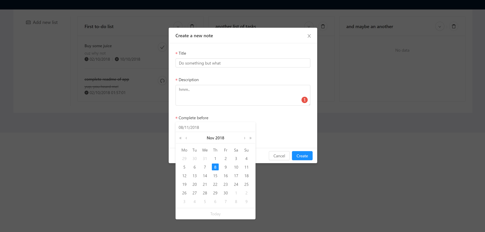
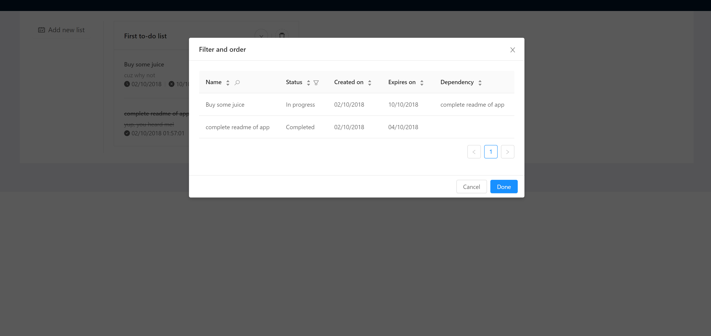

## Getting Started

These instructions will get you a copy of the project up and running on your local machine for development and testing purposes.

<p>
</p>


### Installing

You can easily start the Rest API from the jar file which is at todo-api/target/todo-api-0.0.1-SNAPSHOT.jar.
Run following in cmd or terminal while you're in todo-api/target folder
```
java -jar todo-api-0.0.1-SNAPSHOT.jar
```
Once you have ran the jar file, the server will be available at port 8080.
```
http://localhost:8080
```
To be able to start front-end, make sure that you have npm installed in your system.
Run the following on Todo-UI/myapp folder via terminal or cmd

```
npm install
```
That will download all the required packages for web application to run.
After installation completed, run following on terminal or cmd to start the application

```
npm run start
```
And browse to http://locahost:3000 

## License

This project is licensed under the GNU General Public License v3.0 
